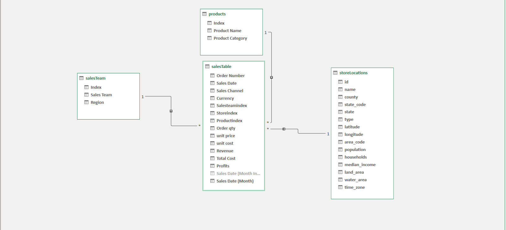
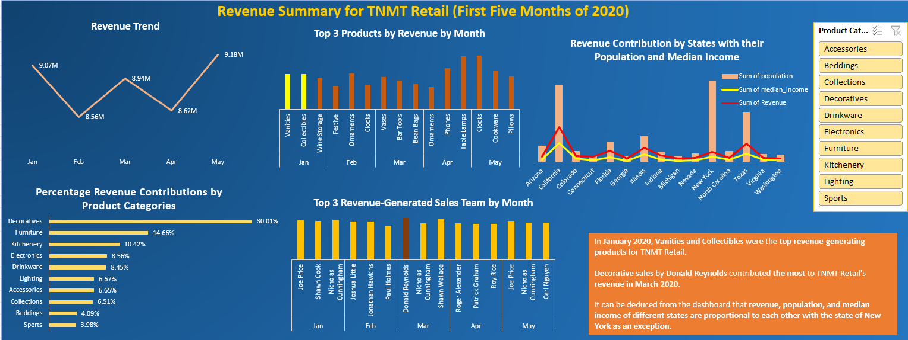
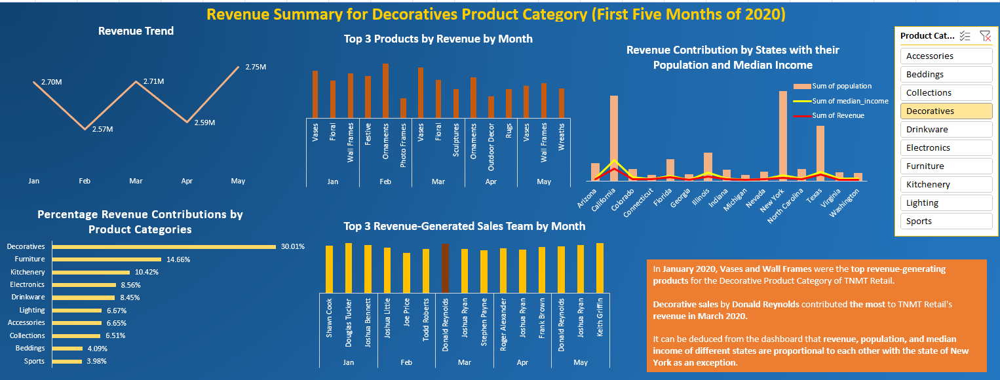

# TNMT-Retail-Sales-Insights-for-the-First-Five-5-Months-of-2020

## Introduction:

Welcome to the **TNMT Retail** documentation, an Excel project focused on analyzing sales data for the purpose of providing valuable insights to support informed decision-making within the retail industry.

**_Important Note_**_: The datasets and reports utilized in this documentation are purely hypothetical and do not depict any specific company, institution, or country. They are entirely simulated datasets intended to highlight my proficiency and capabilities with Microsoft Excel._

## Excel Concepts Demonstrated:

The following Excel features were incorporated.
-	DAX concepts; Calculated columns
-	Filters: Column filters, Slicers for Pivot Tables & Charts
-	Data Modelling, 
-	Pivot Tables and Charts, 
-	Formatting
  
## Research/Project Inquiries:

- What are the two highest revenue-generating products in January?
- Which sales team achieved the highest revenue from Decoratives in March?
- What correlations exist between revenue, population, and the median income of the states?

## Data Acquisition

The dataset was acquired as a CSV file and processed using Microsoft Excel for data cleansing, analysis, and visualization purposes.

It encompasses four distinct sheets:

1. Sales sheet: Comprising 20,000 rows and 13 columns of data.
2. Sales Team sheet: Holding 28 rows and 3 columns of data.
3. Products sheet: Containing 47 rows and 3 columns of data.
4. Store Location sheet: With 367 rows and 15 columns of data.

## Data Transformation and Cleansing

Efficient data transformation was carried out using fundamental Excel tools, involving the following steps:

- Creation of tables for each dataset within the respective worksheets.
  
- Transformation of the 'date' column in the 'Sales table' from the 'general' to the 'date' datatype for improved analysis.
  
- Analytical manipulation within the 'Sales table':
  
  - Calculating 'Revenue' using a custom column: [Revenue] = [@[Order qty]] * [@[unit price]] to  gauge the generated sales income by the sales team.
    
  - Determining 'Profits' by creating a custom column: Profits = [Revenue] - [@[Total Cost]], where [Total Cost] = [@[Order qty]] * [@[unit cost]], to evaluate the total profits made.
    
- Formatting the columns 'Unit price', 'Unit cost', 'Total Cost', 'Revenue', and 'Profits' to the accounting format for consistency and improved readability.

## Data Modeling

The tables were incorporated and structured using PowerPivot, establishing manual connections between related tables. The 'salesTable' serves as the primary fact table within the model. The three remaining tables—'salesTeam', 'products', and 'storeLocations'—are linked to the 'salesTable' via their corresponding shared columns.

This architecture follows a star schema design, where the 'salesTable' acts as the central fact table connected to the surrounding dimension tables.

## Data Analysis and Visualization

From the Excel dashboard above;

1.  May 2020 witnessed the highest revenue, reaching $9.18 million.
2.  The lowest revenue, totaling $8.56 million, was observed in February 2020.
3.	Vanities and Collectibles were observed to be the top revenue-generating products for TNMT Retail in January 2020.
4.	Insights derived indicate a proportional relationship between revenue, population, and median income across various states, with the notable exception of New York.
5.	The category 'Decoratives' significantly contributed to TNMT revenue, amounting to twice the revenue generated by the second highest contributor, which is the 'Furniture' category.
6.  The 'Sports' category made the least contribution to TNMT revenue.

7. When the report was sliced by the **Decoratives** product category, **Donald Reynolds** contributed the most to TNMT Retail's revenue in March 2020. This can be observed in the image above.

  	 
## Conclusion & Recommendations

Top Revenue-Generating Products: Vanities and Collectibles were the top revenue-generating products in January 2020, indicating a potential focus area for increased marketing or inventory management.

Sales Impact of Decoratives: Sales of Decorative items, particularly by Donald Reynolds, significantly contributed to TNMT Retail's revenue in March 2020. This suggests the importance of analyzing and possibly replicating successful sales strategies used for Decoratives in other product categories or by different sales teams.

Correlation Among Revenue, Population, and Median Income: A general trend of proportional correlation between revenue, population, and median income across states was observed, signifying potential market opportunities where higher population and income levels correspond with increased revenue. However, New York appears to be an exception to this trend, warranting a closer investigation into the unique factors impacting sales within that state.

